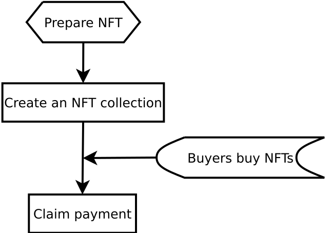
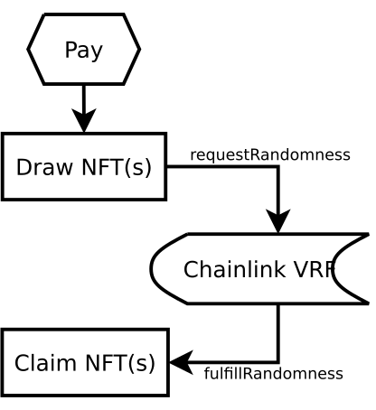
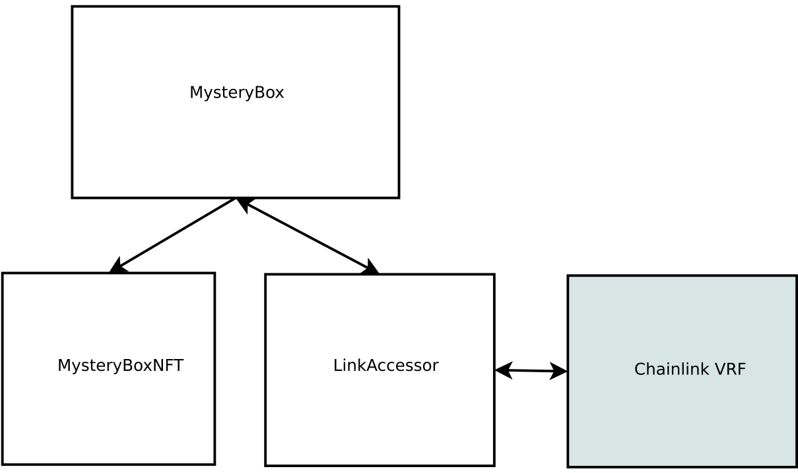

# MysteryBox Smart Contract API

## Roles

### NFT creator

NFT creators can create collections of different kinds of NFTs for their fans to buy. Creators need to specify the probability distribution of these NFT(s). The smart contract will pick NFT(s) for the buyers according to the probability distribution. Besides, creators need to specify the payment options, including tokens and price. After payment, creators can claim payment, as illustrated:

<div align=center>

</div>

### MysteryBox player

MysteryBox players can draw NFT(randomly) from a collection. It is difficult/impossible to generate random numbers in Solidity smart contracts. To keep it fair for all players, we use random numbers generated by [Chainlink VRF](https://docs.chain.link/docs/chainlink-vrf/).

<div align=center>

</div>

## Smart contracts framework

This project consists of three smart contracts: `MysteryBox`, `LinkAccessor`, and `MysteryBoxNFT`.

[comment]: <> (TODO: improe this figure: relationship between them, inheritance relationship, etc)

<div align=center>

</div>

### MysteryBox

MysteryBox smart contract is the hub connecting users, LinkAccessor, and MysteryBoxNFT. Users interact with MysteryBox to create NFT collection, claim payment, claim NFT, etc.

### LinkAccessor

LinkAccessor is a [Chainlink Random Number Consumer](https://docs.chain.link/docs/get-a-random-number/#random-number-consumer). LinkAccessor is a helper smart contract to request random numbers from Chainlink.

### MysteryBoxNFT

MysteryBoxNFT is an [ERC721](https://docs.openzeppelin.com/contracts/2.x/api/token/erc721) smart contract.

## Function Briefing

Previously, we mentioned this project has three smart contracts. However, only the APIs of `MysteryBox` will be listed here, for these reasons:

- `LinkAccessor` is a helper smart contract and users do not need to know its design details.
- `MysteryBoxNFT` is an ERC721 smart contract, so there is no need.

List of functions (follow the link to the comment):

### createCollection

NFT owners can create a collection of NFTs for the players to draw.

```solidity
    function createCollection(
        string calldata _name,
        uint32 _draw_limit,
        uint32 _start_time,
        uint32 _end_time,
        NFTOption[] calldata _nft_options,
        PaymentOption[] calldata _payment
    )
        external
    {}
```

- Parameters:
  - `_name`: name of the collection.
  - `_draw_limit`: maximum number of NFT(s) user can buy.
  - `_start_time`: start time of the sale.
  - `_end_time`: end time of the sale.
  - `_nft_options`: NFT configurations.
  - `_payment`: payment configurations.
- Events:
  - `event CollectionCreated(address indexed owner, uint256 collection_id)`

To differentiate different kinds of NFT(s), we use the upper 128 bits to reflect the type-ID of an NFT. The lower 128 bits is the real ID of the NFT.

<table >
  <tr>
    <td align="center" colspan="2">NFT ID 256 bits </td>
  </tr>
  <tr>
    <td align="center">128-bit type ID</td>
    <td align="center">128-bit ID</td>
  </tr>
</table>

The parameter `_percentage` is the probability distribution of the NFT collection, which also means the number of different kinds of NFT(s) in the collection. After creating a collection, `MysteryBox` smart contract will allocate same number of `type-ID(s)` for them. User can read the allocated `type-ID(s)` from the query result of `getCollectionInfo`.

```solidity
    function getCollectionInfo(uint256 _collection_id)
        external
        view
        returns (
            address _owner,
            string memory _name,
            uint32 _draw_limit,
            uint32 _start_time,
            uint32 _end_time,
            NFTInfo[] memory _nft_list,
            PaymentInfo[] memory _payment_list
        )
    {}
```

- Parameters:
  - `_collection_id`: collection id.
- Return:
  - `_owner`: NFT collection owner address.
  - `_name`: NFT collection name.
  - `_draw_limit`: maximum number of NFT(s) user can buy.
  - `_start_time`: start time of the sale.
  - `_end_time`: end time of the sale.
  - `_nft_list`: NFT information.
  - `_payment_list`: payment information.

### drawNFT

Players can draw NFT(s) from a collection.

```solidity
    function drawNFT(
        uint256 _collection_id,
        uint8 _number_of_nft,
        uint8 _payment_token_index
    )
        external
        payable
    {}
```

- Parameters:
  - `_collection_id`: collection id.
  - `_number_of_nft`: number of NFT(s) players want to buy.
  - `_payment_token_index`: payment option, what kind of token they want to pay for the NFT(s).
- Events:
  - `event NFTDrawn(address indexed owner, bytes32 request_id)`

### isReadyToClaim

Check if a player's NFT(s) are ready to claim.
If users call `claimNFT` before they are ready, transactions would revert with `invalid random number` error.

```solidity
  function isReadyToClaim(address _user_addr) external view returns(bool) {
```

- Parameters:
  - `_user_addr`: players' wallet address

### claimNFT

After players `drawNFT` successfully, they can `claimNFT` when the NFT(s) are ready to claim.

```solidity
  function claimNFT() external {}
```

- Parameters:
  - N/A
- Events:
  - `Transfer(address from, address to, uint256 tokenId)`

### claimPayment

NFT owners can `claimPayment` after NFT(s) are sold.

```solidity
    function claimPayment(uint256[] calldata _collection_ids) external {}
```

- Parameters:
  - `_collection_ids`: list of collection ids. The `caller` must be the creator of these NFT collections. Otherwise, transactions would revert.
- Events:

```solidity
    event ClaimPayment (
        address indexed owner,
        uint256 indexed collection_id,
        address token_address,
        uint256 amount,
        uint256 timestamp
    );
```
