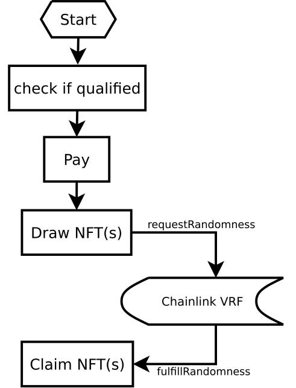
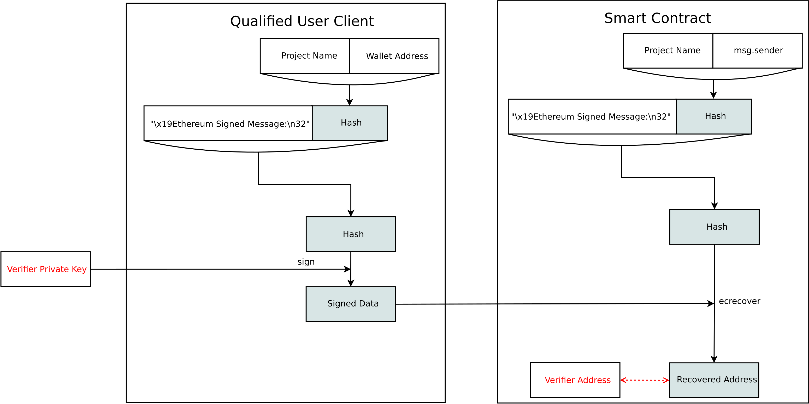
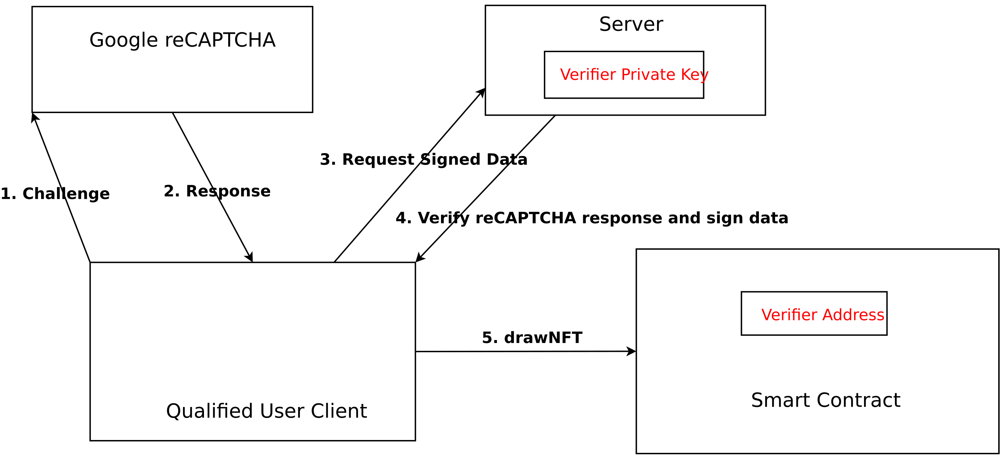

# MysteryBox Smart Contract API

## Roles

### NFT creator

NFT creators can create collections of different kinds of NFTs for their fans to buy. Creators need to specify the probability distribution of these NFT(s). The smart contract will pick NFT(s) for the buyers according to the probability distribution. Besides, creators need to specify the payment options, including tokens and price. After payment, creators can claim payment, as illustrated:

<div align=center>

</div>

### MysteryBox player

MysteryBox players can draw NFT(randomly) from a collection. As shown in the following figure, players need to be qualified and users need to pay(NFT + fee).

We use random numbers generated by [Chainlink VRF](https://docs.chain.link/docs/chainlink-vrf/). `MysteryBox` smart contract needs to pay `$LINK token` for this service. To cover this cost, `MysteryBox` smart contrat address will charge users a small amount of `ETH` for `drawNFT`(the `fee()` interface can be used to query how much `ETH`).

Besides, It takes time for the Chainlink VRF to generate and send the random number back to our smart contract. Considering the [network concongestion](https://docs.chain.link/docs/get-a-random-number/#network-congestion-and-responsiveness), we need to be able to wait for long enough for the random number.

<div align=center>

</div>

## Smart contracts framework

This project consists of four smart contracts: `Qualification`, `MysteryBox`, `LinkAccessor`, and `MysteryBoxNFT`.

[comment]: <> (TODO: improe this figure: relationship between them, inheritance relationship, etc)

<div align=center>

</div>

### MysteryBox

MysteryBox smart contract is the hub connecting users, LinkAccessor, and MysteryBoxNFT. Users interact with MysteryBox to create NFT collection, claim payment, claim NFT, etc.

### LinkAccessor

LinkAccessor is a [Chainlink Random Number Consumer](https://docs.chain.link/docs/get-a-random-number/#random-number-consumer). LinkAccessor is a helper smart contract to request random numbers from Chainlink.

`LinkAccessor` also has the capability to `swap`(Uniswap) `ETH fee` for `$LINK` tokens to pay for the `Chainlink VRF` service.

### MysteryBoxNFT

MysteryBoxNFT is an [ERC721](https://docs.openzeppelin.com/contracts/2.x/api/token/erc721) smart contract.

### Qualification

Sometimes, the NFT collection owner/creator only wants some users to participate in the NFT sale. For example, an artist has a limited number of NFT(s) and he/she only wants his/her fans to buy his/her NFT(s). Qualification smart contracts are designed to enable people to achieve this. When the artist creates an NFT collection, he/she needs to provide a `qualification smart contract`. When a user tries to `drawNFT`, `MysteryBox` smart contract will interact with `qualification smart contract` and check if a user is qualified to do that. He/she can add the wallet address into a whitelist and only whiltelisted users can participate.

Qualification smart contracts need to implement [IQLF interface](../contracts/interfaces/IQLF.sol) and they need to implement these:

- `function version() virtual external view returns (uint32);`
- `function is_qualified(address account, bytes memory proof) virtual external view returns (bool, string memory)`

The first API is to provide the version of a qualification smart contract. Reserved version numbers are listed in the following table:

| Version | Name/Implementation                                     |
| ------- | ------------------------------------------------------- |
| 1       | [White List](../contracts/WhitelistQlf.sol)             |
| 2       | [Signature Verification](../contracts/SigVerifyQlf.sol) |
| 3       | [Merkle Proof](../contracts/MerkleProofQlf.sol)         |

The second API is the one used to check if a user is qualified. The `qualification smart contract` implementation can be flexible. For instance, compared to `White List`, `Merkle Proof` implementation is relatively cheap, because there is no need to store lots of wallet addresses on the blockchain.

### Whitelist Qualification

Contract owner can add/delete the whitelisted address into the `White List` qualification smart contract.

```solidity
function add_white_list(address[] memory addrs) external onlyOwner {}
function remove_white_list(address[] memory addrs) external onlyOwner {}
```

### Signature Verification Qualification

`Signature Verification` smart contract will validate if a user's address has been signed by a specific `elliptic curve` private key.

Following figure shows the `Signature Verification` smart contract framework.
When a user tries to `drawNFT`, he/she needs to provider valid [EIP-191](https://eips.ethereum.org/EIPS/eip-191) compliant signed data to prove his/her account is qualified. How the data is signed can be flexible.

<div align=center>

</div>

Following is a reference design and it shows how to protect your NFT sale from bots. [Google ReCAPTCHA](https://en.wikipedia.org/wiki/ReCAPTCHA) can be used to distinguish between human and bots. And your server only signs data for real users. Then only real users can `drawNFT` successfully.

<div align=center>

</div>

The design itself can be flexible. For example, you can store your whitelisted users on the server and your server can only sign for whitelisted users.

### MerkleProofQlf Verification Qualification

`Merkle Proof` smart contract checks if an address is one of the leaf nodes of a [Merkle Tree](https://en.wikipedia.org/wiki/Merkle_tree).

## Function Briefing

Previously, we mentioned this project has three smart contracts. However, only the APIs of `MysteryBox` will be listed here, for these reasons:

- `LinkAccessor` is a helper smart contract and users do not need to know its design details.
- `MysteryBoxNFT` is an ERC721 smart contract, so there is no need.

List of functions (follow the link to the comment):

### createCollection

NFT owners can create a collection of NFTs for the players to draw.

```solidity
    function createCollection(
        string calldata _name,
        uint32 _purchase_limit,
        uint32 _start_time,
        uint32 _end_time,
        NFTOption[] calldata _nft_options,
        PaymentOption[] calldata _payment,
        address _qualification
    )
        external
    {}
```

- Parameters:
  - `_name`: name of the collection.
  - `_purchase_limit`: maximum number of NFT(s) users can buy.
  - `_start_time`: start time of the sale.
  - `_end_time`: end time of the sale.
  - `_nft_options`: NFT configurations.
  - `_payment`: payment configurations.
  - `_qualification`: address of the qualification smart contract. Users need to prove they are qualified to draw NFT from this collection. `address(0)` means all users are qualified(no qualification at all).
- Events:
  - `event CollectionCreated(address indexed owner, uint256 collection_id)`

To differentiate different kinds of NFT(s), we use the upper 128 bits to reflect the type-ID of an NFT. The lower 128 bits is the real ID of the NFT.

<table >
  <tr>
    <td align="center" colspan="2">NFT ID 256 bits </td>
  </tr>
  <tr>
    <td align="center">128-bit type ID</td>
    <td align="center">128-bit ID</td>
  </tr>
</table>

The parameter `_percentage` is the probability distribution of the NFT collection, which also means the number of different kinds of NFT(s) in the collection. After creating a collection, `MysteryBox` smart contract will allocate a same number of `type-ID(s)` for them. User can read the allocated `type-ID(s)` from the query result of `getCollectionInfo`.

```solidity
    function getCollectionInfo(uint256 _collection_id)
        external
        view
        returns (
            address _owner,
            string memory _name,
            uint32 _purchase_limit,
            uint32 _start_time,
            uint32 _end_time,
            uint32 _total_quantity,
            uint32 _drawn_quantity,
            uint32 _claimed_quantity,
            NFTInfo[] memory _nft_list,
            PaymentInfo[] memory _payment_list,
            address _qualification
        )
    {}
```

- Parameters:
  - `_collection_id`: collection id.
- Return:
  - `_owner`: NFT collection owner address.
  - `_name`: NFT collection name.
  - `_purchase_limit`: maximum number of NFT(s) user can buy.
  - `_start_time`: start time of the sale.
  - `_end_time`: end time of the sale.
  - `_total_quantity`: total number of NFT(s) in this collection.
  - `_drawn_quantity`: number of NFT(s) sold in this collection.
  - `_claimed_quantity`: number of NFT(s) claimed in this collection.
  - `_nft_list`: NFT information.
  - `_payment_list`: payment information.

```solidity
    function getPurchaseInfo(
        uint256 _collection_id,
        address _user_addr
    )
        external
        view
        returns (
            uint32 _purchase_limit,
            uint32 _purchased_number,
            uint256[] memory _history
        )
    {}
```

- Parameters:
  - `_collection_id`: collection id.
  - `_user_addr`: users' wallet address.
- Return:
  - `_purchase_limit`: maximum number of NFT(s) users can buy.
  - `_purchased_number`: number of NFT(s) users already paid.
  - `_history`: ID list of NFT(in this collection) users already claimed.

### drawNFT

Players can draw NFT(s) from a collection.

```solidity
    function drawNFT(
        uint256 _collection_id,
        uint8 _number_of_nft,
        uint8 _payment_token_index,
        bytes memory _proof
    )
        external
        payable
    {}
```

- Parameters:
  - `_collection_id`: collection id.
  - `_number_of_nft`: number of NFT(s) players want to buy.
  - `_payment_token_index`: payment option, what kind of token they want to pay for the NFT(s).
  - `_proof`: data to prove that a user is qualified to draw NFT(s).
- Events:
  - `event NFTDrawn( address indexed owner, uint256 indexed collection_id, uint8 number_of_nft)`

### isReadyToClaim

Check if a player's NFT(s) are ready to claim.
If users call `claimNFT` before they are ready, transactions would revert with an `invalid random number` error.

```solidity
    function isReadyToClaim(
        uint256 _collection_id,
        address _user_addr
    )
        external
        view
        returns(bool)
    {}
```

- Parameters:
  - `_user_addr`: players' wallet address

### claimNFT

After players `drawNFT` successfully, they can `claimNFT` when the NFT(s) are ready to claim.

```solidity
    function claimNFT(uint256 _collection_id) external {}
```

- Parameters:
  - `_collection_id`: collection id.
- Events:
  - `Transfer(address from, address to, uint256 tokenId)`

### claimPayment

NFT owners can `claimPayment` after NFT(s) are sold.

```solidity
    function claimPayment(uint256[] calldata _collection_ids) external {}
```

- Parameters:
  - `_collection_ids`: list of collection ids. The `caller` must be the creator of these NFT collections. Otherwise, transactions would revert.
- Events:

```solidity
    event ClaimPayment (
        address indexed owner,
        uint256 indexed collection_id,
        address token_address,
        uint256 amount,
        uint256 timestamp
    );
```

### fee

Get the amount of extra `ETH` users need to pay for `drawNFT`.

```solidity
    function fee() returns(uint256) external {}
```
